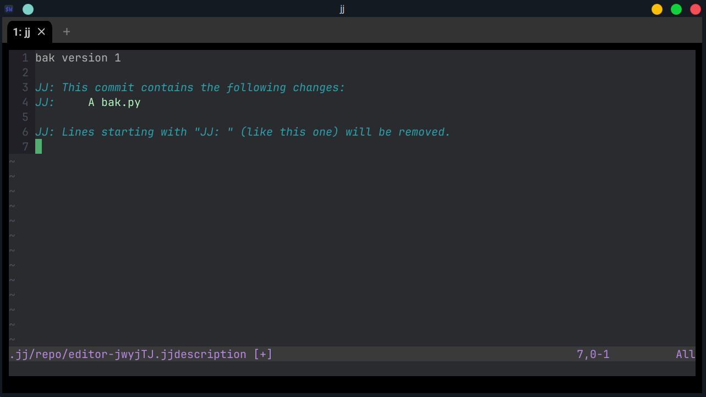

# Using `jj describe` to describe our commits in a human-friendly way

While we can refer to our changes by their change ID or commit hash, that's not
always great. Text is a much better way to describe things for humans.

However, before we can describe commits, we have to let `jj` know who we are.
Let's set some quick configuration:

```console
$ (~/bak) jj config set --user user.name "Code Lab"
$ (~/bak) jj config set --user user.email "codelab@example.com"
```

Okay, with that out of the way, we're ready to describe our changes.

What changes? Sometimes, us developers want to preview all the changes that were made.
This is made possible by the `jj diff` command:
```console
$ (~/bak) jj diff
bak.py --- Python
 1 import sys
 2
 3 def main():
 4     print('bat - a simple backup tool')
 5     if len(sys.argv) == 1:
 6         print('Usage: bat <command> [<args>]')
 7         sys.exit(1)
 8     filename = sys.argv[1]
 9     backup_filename = filename + '.bak'
10     with open(backup_filename, 'w') as file_write:
11         with open(filename, 'r') as file_read:
12             file_write.write(file_read.read())
13     return
14
15 if __name__ == "__main__":
16     main()
```

Whenever we feel like it[^whenever], we can describe our changes with `jj describe`.
The simplest way to use it is with the `-m`, or "message" flag. This allows us
to pass the description on the command line:

```console
$ (~/bak) jj describe -m "bak version 1"
Working copy now at: mqxqrzlm 6d3840e5 (no description set)')
Parent commit      : zzzzzzzz 00000000 (empty) (no description set)
```

Our message, `bak version 1`, has replaced the `(no description set)` text. We're
gonna be able to see this whenever we look at our repository history.

For more real changes though, you'll probably want to not use the `-m` flag.
And, since descriptions can be set at any time, we can also change them too.
Let's try it again:

```console
$ (~/bak) jj describe
```

An editor will pop up; if you're on Windows, you're getting Notepad. If you're on *nix, you'll get your `$EDITOR`.



This window shows my original message, "bak version 1" and then
a bunch of lines that start with `JJ: `. As the final one mentions,
these lines are ignored when forming the commit description. So let's
make a longer description, like this:

```text
bak version 1

This is an initial implementation, nothing fancy.
It reads single file from the args list and backs it up.

More fun stuff to come.

JJ: This commit contains the following changes:
JJ:     A bak.py

JJ: Lines starting with "JJ: " (like this one) will be removed.
```

After saving and closing, we'll get this output:

```console
Working copy now at: mqxqrzlm 69e3b8b0 bak version 1
Parent commit      : zzzzzzzz 00000000 (empty) (no description set)
```

Take a note of the commit hash. Changing our description also changed the commit hash, just like in `git`. But, the change ID is still the same. This is why we have both
the change ID, which has not changed, and the commit hash that has. This allows us to evolve
our commit over time, but still have a stable way to refer to all versions of it.

This change is pretty much done - we implemented the functionality and gave the change a description. Time to make new changes!

## Summary

* Use `jj describe` to give or modify the description of the current change in any point in time

<hr/>

[^whenever]: I truly mean whenever. If you stacked `N` more commits in your unpublished project and then noticed a typo, you can easily fix it with `jj describe` and all the commits would be rebased _automatically_ - good luck doing that with git. We'll see an example later on.
