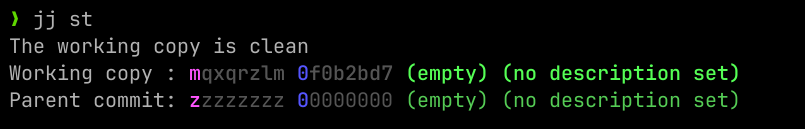

# Viewing the current status with `jj st`

We can view the status of our repository with `jj st`. Let's run that now:

```console
$ (~/bak) jj st
```
// TODO check if image is correct. It was created by digital manipulation


This is the `jj` "pager", a program that shows the ouput of commands, and lets
you scroll through them if they get really long. You can hit `q` to get back to
your console.

You can request to not use the pager by using `jj st --no-pager`, or if you hate
the pager and want to turn it off, you can configure that with

```console
$ (~/bak) jj config set --user ui.paginate never
```

I am going to present the examples in the book as if this is the configuration,
because managing text is easier than wrangling screenshots. The same information
ends up on the screen no matter which way you prefer. Speaking of, let's actually
talk about the output of `jj st`:

```console
$ (~/bak) jj st --no-pager
Working copy is clean.
Working copy : mqxqrzlm 0f0b2bd7 (empty) (no description set)
Parent commit: zzzzzzzz 00000000 (empty) (no description set)
```

There's a _surprising_ amount of stuff to talk about here! Let's dig into it from the ⬇️top down⬇️:

## Working copy

```
Working copy is clean.
Working copy : mqxqrzlm 0f0b2bd7 (empty) (no description set)
```

One of the largest differences between `git` and `jj` is the concept of a **working copy**.

Unlike `git`, `jj` has no index.
Wait, don't close the tab! Here's the thing: `jj` gives you the same ability to
craft artisinal, beautiful commits that have exactly what you want in them. But
it doesn't need an index to do it.

This is a running theme with `jj`: it gives you fewer tools, but those tools end
up having equivalent or even more power than their `git` counterparts. Because
there are fewer tools, there's also less to learn. Making something more powerful *and* easier? Sign me up!

The working copy is the state of the current directory with respect to the previous commit and it is a _commit in and of itself_. Modifying the contents of the directory (adding/deleting lines or files) will modify the working copy. You can think of it sort of as a staging area of `git`, that you edit all the time - every change, until commited, is a part of a working copy.

For now, what we
need to know is that every time you run a `jj` command, it examines the working
copy (the files on disk) and takes a snapshot. 
Working copy is currently clean, as told by the message at the top and the `(empty)` string. We also did not give a description to the working copy. That is because we haven't really did anything yet. We'll fix that soon.

In the second line, we see a couple more info datums. `mqxqrzlm` and `0f0b2bd7` are two identifiers of the commit that is a working copy. `mqxqrzlm` is what is known as **change ID** and `0f0b2bd7` is **commit hash**. Change ID of a commit is the same for the entirety of its life, while the commit hash changes with respect to the content. This will be illustrated after we explain what is the root commit.

## Root commit `root()`

```text
Parent commit: zzzzzzzz 00000000 (empty) (no description set)
```

This line denotes a root commit named, unsuprisingly, `root()`[^root]. Its **commit hash** is `00000000` and its **change ID** is `zzzzzzzz`. Every `jj` project has a root commit, which is always empty and immutable. The root commit is an ancestor of all the commits[^git], and a (direct) parent of the first working copy, at the start of your project.


[TODO RECAP PIC]

## Change ID vs. commit hash

To get a feel for the difference between the commit hash and a change ID, let's modify the working copy by actually adding some code. Write a `bak.py` with the following contents:
```python
import sys

def main():
    print('bat - a simple backup tool')
    if len(sys.argv) == 1:
        print('Usage: bat [file]')
        sys.exit(1)
    filename = sys.argv[1]
    backup_filename = filename + '.bak'
    with open(backup_filename, 'w') as file_write:
        with open(filename, 'r') as file_read:
            file_write.write(file_read.read())
    return

if __name__ == "__main__":
    main()
```

This is a primitive implementation of a backup utility. It checks the number of arguments, it gets the file name of the file to back up, and writes the contents of the original file.

If we run `jj st` again, what we'll see is **fundamental** to `jj`:
```console
$ (~/bak) jj st
Working copy changes:
A bak.py
Working copy : mqxqrzlm 49fee2c6 (no description set)
Parent commit: zzzzzzzz 00000000 (empty) (no description set)
```

Because there's now a change in the working copy, it's not "empty" anymore &ndash; we didn't have to run any command, pure act of adding a file did it.
So here, it's noticed that we've `A`dded some new files. You'll also see `M`odified files, and `D`eleted files.

In addition to that, if you compare this output with the last one, you'll see that the commit hash has changed, which makes sense because the contents of the working copy commit, upon which the hash is based, is now different. But the **change ID has remained the same** - and it will for the life of the change. Neat! Furthermore, since the change ID is so permanent, it can act like a ref for a commit. Change IDs and commit hashes are built upon different letter sets[^hash] so there's never confusion if you mean change ID or commit hash. We'll see the use of it later on.

// todo think about changes like git commits, but every change can have multiple revisions (which are implemented as git commits)


Finally, both of our changes say `(no description set)`, and that's because we
haven't given them a description yet! We'll talk about descriptions in the next
section.

## Summary

* The working copy is a new concept which is a commit with all the current changes, that you frequently modify until you commit it
* Every `jj` project has a `root()` commit
* Use `jj st` to see the status of the working copy
* Use `jj log` to see previous commits
* Every commit has a change ID which will stay the same throughout the commit's life

<hr/>

[^root]: The reason why its name is written with parentheses is because it's actually a function returning the root commit. This is a sneak peek of a powerful mini-language for describing sets of revisions, i.e. revsets
[^git]: One may think `git` commits ought to have a common ancestor but that's not true. It's valid for two commits to have disjunct histories, as is the case with [orhpan branches](https://git-scm.com/docs/git-checkout#Documentation/git-checkout.txt---orphanltnew-branchgt). Merging such branches is non-trivial at best, and outright impossible at worst; `jj`, on the other hand, guarantees that at the very least two commits share the `root()` as an ancestor.
[^hash]: commit hashes are hex characters `[0-9a-f]`, and change IDs are `[k-z]`[^why]
[^why]: If you're wondering why skip `[ghij]` letters, that's because `[k-z]` group also has 16 letters like hex characters :)
